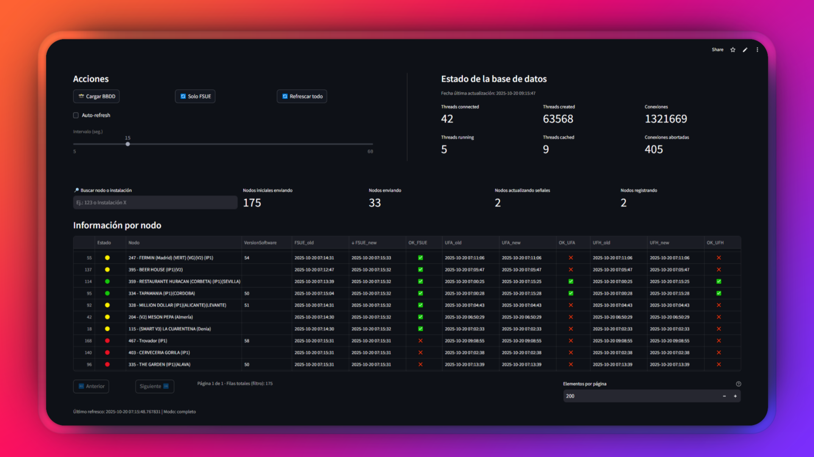

# Verificador de Despliegue

Bienvenido al **Verificador de Despliegue**. Esta aplicación te permite comparar el estado actual de los nodos de una base de datos con una "foto" inicial (baseline), facilitando la verificación de despliegues y actualizaciones en sistemas conectados a MySQL a través de SSH.



---

## 🚀 Cómo ejecutar la aplicación

Sigue estos pasos para poner en marcha la aplicación en tu entorno local:

1. **Crea un entorno virtual con Python 3.10:**
   ```
   py -3.10 -m venv .venv
   ```

2. **Activa el entorno virtual:**
   ```
   .\.venv\Scripts\activate.bat
   ```

3. **Instala las dependencias necesarias:**
   ```
   pip install -r requirements.txt
   ```

4. **Configura tus credenciales en `.streamlit/secrets.toml`:**
   > Debes crear el archivo `.streamlit/secrets.toml` con la configuración de acceso SSH y MySQL. Ejemplo:
   > 
   > ```
   > [ssh]
   > host = "tu_host_ssh"
   > port = tu_puerto_ssh
   > user = "tu_usuario_ssh"
   > password = "tu_contraseña_ssh"
   > 
   > [mysql]
   > host = "127.0.0.1"
   > port = 3306
   > user = "tu_usuario_mysql"
   > password = "tu_contraseña_mysql"
   > database = "nombre_base_datos"
   >
   > [app]
   > timezone = "Europe/Madrid"
   > ```


1. **Ejecuta la aplicación:**
   ```
   streamlit run app.py
   ```

---

## 📝 ¿Qué hace esta aplicación?

- **Captura un baseline:** Toma una "foto" de las fechas clave de cada nodo en la base de datos.
- **Compara el estado actual:** Permite comparar el estado actual de los nodos con el baseline para verificar si han cambiado correctamente tras un despliegue.
- **Visualización clara:** Muestra métricas globales y una tabla detallada por nodo, indicando con iconos si cada campo ha cambiado como se esperaba.
- **Auto-refresh:** Permite refrescar automáticamente la comparación a intervalos configurables.

---